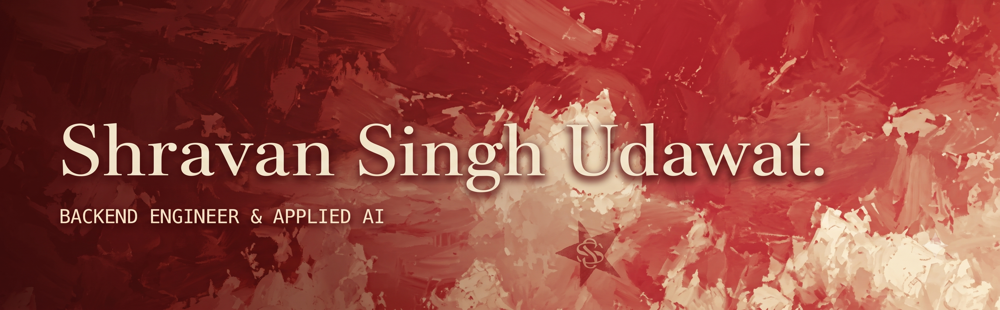

  
  
  

 

Building backend services and applied AI systems that hold up under real load: enterprise REST APIs on SQL/PostgreSQL backends, deterministic state machines for orchestration and recovery, simulation-guided decision agents, and embedding-based retrieval pipelines engineered for correctness and latency at scale.

I'm a Computer Science undergraduate at VIT Vellore, and most of what's below is a record of moving systems past the prototype stage replacing fragile, manual workflows with services that degrade gracefully and recover on their own.

 

## Experience

**BKT** — Software Engineering Summer Intern &nbsp;·&nbsp; *10 May 2026 – 30 June 2026*

Worked alongside SAP teams and business consultants to replace manual, repetitive aggregation queries with a robust API layer for internal sales analytics.

- Developed a Spring Boot backend exposing REST APIs over SQL Server data for recurring sales analytics.
- Wrote SQL Server stored procedures, functions, and triggers to support enterprise sales workflows.
- Validated OutSystems CRUD operations to protect data integrity across the platform.
- Built Power BI dashboards and SQL reports to monitor sales KPIs for business reporting.

 

## Featured Projects

**[ASTra](https://github.com/shravan606756/ASTra)** — A codebase comprehension tool that parses Java abstract syntax trees into a searchable, semantic index queried in plain English.
`Java 21` `Spring Boot` `PostgreSQL` `pgvector` `JavaParser` `LLMs`

View details

 

- Architected a Spring Boot REST service backed by PostgreSQL with the pgvector extension for approximate nearest-neighbor search over embedded code symbols.
- Built an adaptively batched, multithreaded indexing pipeline that reduced processing time by ~49% when parsing a 1,700+ class repository.
- Implemented semantic chunking and token-budget-aware context assembly to feed multiple LLM backends (OpenAI, Ollama, Groq), returning answers with exact line-level source references.
- Built a decoupled, interactive CLI client and an automated benchmarking suite to measure retrieval-quality and latency regressions.

 

**[Multi-Threaded DPI Engine](https://github.com/shravan606756/multi-threaded-dpi-engine)** — A high-performance network traffic analysis platform combining a multi-threaded C++ deep packet inspection engine with a Spring Boot orchestration backend and AI-powered insights.
`C++` `Spring Boot` `Redis` `Docker` `Llama 3`

View details

 

- Architected a multi-threaded C++ DPI engine with a load-balancer → fast-path worker pipeline, using five-tuple flow hashing to route packets deterministically and keep per-connection state race-free across threads.
- Built a layered packet-parsing pipeline (Ethernet/IP/TCP/UDP) with TLS SNI and HTTP host extraction to classify traffic by application and domain, applying rule-based blocking and emitting structured JSON analytics.
- Designed a Spring Boot orchestration layer that runs the native binary asynchronously via `ProcessBuilder`, with Redis-backed job-state and AI-response caching, and Groq (Llama 3.3-70B) generated traffic risk summaries.

 

**[ResilientDB](https://github.com/shravan606756/ResilientDB-Engine)** — A pluggable backup orchestration engine that decouples core scheduling logic from database-specific backup implementations.
`Java` `Spring Boot` `PostgreSQL` `AWS (EC2, RDS, ECR)` `Docker` `GitHub Actions`

View details

 

- Uses a Strategy Pattern-based engine supporting interchangeable PostgreSQL, MySQL, and MongoDB backup drivers without touching core orchestration code.
- Runs an asynchronous worker pool with exponential backoff retry logic to prevent HTTP thread-pool exhaustion during sustained backup load.
- Models job lifecycle as a deterministic finite state machine (PENDING → PROCESSING → COMPLETED/FAILED) with real-time health metrics, cutting mean time to recovery from hours to seconds.

 

## Other Projects

| Project | What it does | Stack |
|---|---|---|
| **[Eco-Looping Building Agent](https://github.com/shravan606756/eco-looping-building-agent)** | Closed-loop control system that optimizes HVAC energy consumption and occupant comfort through simulation-guided decision-making, with a Groq Llama 3.3 agent evaluating a matrix of simulated physical outcomes rather than fixed temperature heuristics. | `Python` `EnergyPlus` `Groq Llama 3.3` `Streamlit` `Pydantic` |
| **[TranscriptIQ](https://github.com/shravan606756/TranscriptIQ)** | Fault-tolerant audio intelligence pipeline turning long-form podcast transcripts into precisely retrievable answers, with a multi-tier ingestion pipeline cutting speech-to-text latency by 85% and FAISS + Llama-3.3 retrieval cutting search time by 65%. | `Python` `Transformers` `FAISS` `Whisper` `Llama-3 via Groq` |
| **[Email Writer Service](https://github.com/shravan606756/email-writer-springboot)** | Chrome extension that injects AI-generated, tone-controlled reply drafts directly into Gmail's compose UI via a stateless Spring Boot + Gemini API backend. | `Java` `Spring Boot` `React` `Chrome Extension` `Gemini API` |
| **[Hybrid Lexical-Semantic Matching](https://github.com/shravan606756/hybrid-lexical-semantic-matching)** | Interpretable NLP pipeline for candidate-role matching, combining TF-IDF lexical scoring with MiniLM embedding similarity and an explainability layer that surfaces top-contributing sentences behind each ranking. | `Python` `Scikit-learn` `Sentence Transformers` `Streamlit` |

 

## Technical Stack

**Languages**

**Frameworks & Libraries**

**AI / ML**

**Cloud & DevOps**

**Databases**

**Tools**

 

## Certifications

View certifications (5)

 

**Microsoft Certified: Azure AI Engineer Associate** — Microsoft &nbsp;·&nbsp; Issued Jul 2025 · Expires Jul 2027

**Oracle Fusion AI Agent Studio Certified Foundations Associate** — Oracle &nbsp;·&nbsp; Issued Oct 2025

**Oracle Data Platform** — Oracle &nbsp;·&nbsp; Issued Oct 2025

**Oracle AI Cloud Infrastructure** — Oracle &nbsp;·&nbsp; Issued Oct 2025

**Oracle AI Foundation** — Oracle &nbsp;·&nbsp; Issued Oct 2025

 

Open to opportunities in backend engineering, and AI-integrated systems.

