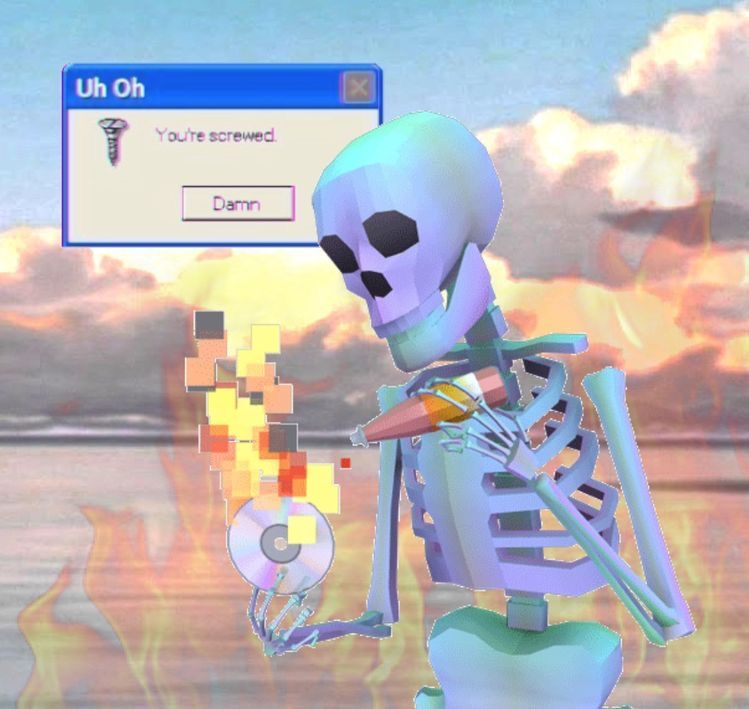
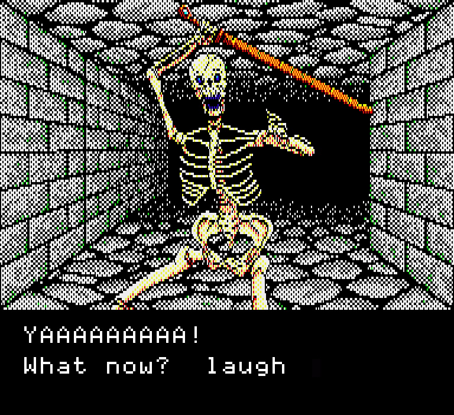

giut<p align="center">

</p>

<p align="center">

</p>

<p align="center">

</p>

████████████████████████████████████████████████

```diff
+ SYSTEM ONLINE
+ USER: SHRAVAN UDAWAT
+ ROLE: COMPUTER SCIENCE STUDENT
+ MODE: DARK TERMINAL
+ STATUS: BUILDING COOL THINGS
```

████████████████████████████████████████████████

```bash
> interests
AI
Machine Learning
Systems
Competitive Programming
```

```bash
> currently_learning
Operating Systems
Computer Networks
Compiler Design
```

████████████████████████████████████████████████


████████████████████████████████████████████████
